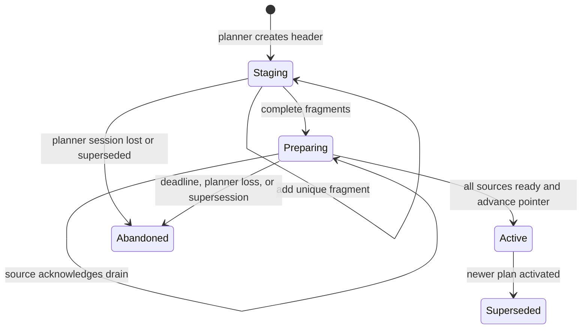

# Plan-Epoch Lease Coordination

## Summary

Blob Stream uses per-partition lease rows for two separate reasons:

1. To learn whether an owner is still alive.
2. To retain durable progress and fence a stale owner from producer sequence allocation, consumer
   cursor commits, and producer metadata publication.

The first job costs a periodic DynamoDB write for every owned partition, even when that partition
has no traffic. The second job must remain per partition because sequence high-water and consumer
progress are intrinsically per partition.

This plan moves liveness to a small, session-aware control plane: one heartbeat per broker or
consumer member and one heartbeat per planner scope. A versioned ownership plan then authorizes
per-partition transfers. The durable partition row remains the authority for Hi-Lo allocation,
consumer commits, and handoff.

For producers, a plan can also supply a cheaper, coarse-grained replacement for the current
per-partition metadata-publication fence. That is a separate choice from plan-based ownership:
after a scope migrates, it always uses plan epochs to coordinate ownership, while its existing
fenced-write mode decides whether accepted metadata is fenced at publication time.

The rollout is producer writer domains first, then consumer groups. Feature flags target individual
writer domains and consumer groups; no static configuration or protocol knob opts a deployment
into plan epochs. Plan control records share the existing `consumer_group_membership` DynamoDB
table under a new reserved namespace. Plans use an immutable header and fixed-range fragments from
the first release.

## Current System and Its Cost Levers

### Current ownership flow

A producer partition row stores the holder, process session, lease epoch, expiry, and durable
Hi-Lo high-water. A broker renews every locally assigned row. The same conditional update may also
reserve a Hi-Lo range, so sequence allocation and a regular heartbeat can share a write.

A consumer group already separates desired placement from actual authority. Its membership table
stores members, a planner lease, and one desired assignment plan. Its partition rows retain actual
owner, generation, cursor, and source checkpoint. A consumer can read only after claiming a row,
but it then renews every owned row periodically.

This means the existing design is correct, but it pays per-partition liveness cost in both paths.

### The four cost levers

The following operations are independent. Measurements and rollout decisions must keep them
separate.

| Lever | Current operation | What drives cost | Tradeoff |
| --- | --- | --- | --- |
| Producer lease maintenance | Renew every owned producer-partition lease. | Partition count and heartbeat interval. | Longer expiry and heartbeat reduce writes but delay recovery after broker loss. |
| Consumer lease maintenance | Renew every owned consumer-partition lease. | Partition count and heartbeat interval. | Longer expiry and heartbeat reduce writes but delay recovery after consumer loss. |
| Producer sequence reservation | Conditionally advance one partition's Hi-Lo high-water. | Traffic, reservation size, restarts, and churn. | Larger reservations reduce writes but leave larger legal sequence gaps after loss. |
| Consumer cursor commit | Conditionally persist one partition's cursor and source checkpoint. | Delivery rate and application commit cadence. | Batched commits reduce writes but increase permitted redelivery after loss. |

For $P_w$ producer virtual partitions, $P_g$ partitions in consumer group $g$, and heartbeat
interval $H$ seconds, the two idle renewal floors are:

$$
W_{producer\_renewal} = \frac{P_w}{H}, \qquad
W_{consumer\_renewal,g} = \frac{P_g}{H}
$$

The current baseline is a 120-second expiry and 40-second heartbeat. With 99 logical partitions
and three writer domains, there are 297 producer virtual partitions:

$$
\frac{297}{40} = 7.425\ \text{producer-renewal writes per second}
$$

A consumer group owning those same partitions has the analogous 7.425 renewal-write floor before
member/planner coordination and cursor commits. These are control-plane floors, not total cost.

### Fenced metadata publication is a fifth cost lever

`fenced_metadata_writes` protects a producer batch after the broker accepted it but before the
broker publishes its blob metadata. The broker captures the holder, session, and epoch for every
partition included in a metadata row. The current DynamoDB transaction contains:

- one metadata `Put`; and
- one producer-partition `ConditionCheck` for each participating partition.

For a row with $K$ partitions, the transaction has $1 + K$ items. This is why the scheduler splits
fenced publication at 99 partitions. A longer producer lease reduces lease-renewal traffic but does
not reduce these per-partition checks. Larger flushes improve packing but make the current fencing
transaction more expensive and hit the 99-partition boundary sooner.

The fence is still necessary. Without it, a broker that accepted and uploaded a batch before losing
ownership can publish that old metadata after a successor publishes later sequences.

## The Plan-Epoch Idea

### Separate liveness from durable progress

A plan-epoch scope has live member sessions, one planner, and one active ownership plan:

- A **member session** says that a broker or consumer process is still alive.
- A **planner** turns the live member set into a deterministic desired assignment.
- An **active ownership plan** assigns every partition to one exact member session.
- A **partition row** changes only when ownership actually moves; it retains high-water or cursor
  progress and fences data-plane operations.

The steady-state liveness cost becomes:

$$
W_{plan\_liveness} = \frac{M + L}{H}
$$

where $M$ is active member sessions and $L$ is planner scopes. Six brokers across three writer
domains would use $(6 + 3) / 40 = 0.225$ liveness writes per second, instead of the illustrative
7.425 producer partition-renewal writes per second.

The design does **not** remove traffic-driven sequence reservations or cursor commits. It removes
only periodic liveness renewal from stable partition ownership.

### Ownership and publication fencing are independent

A producer writer-domain plan is a complete, immutable assignment snapshot. Before accepting a
batch, a broker verifies that its local session is assigned that partition in the active plan. It
records the active plan ID, version, header hash, and its member ID/session with the accepted batch.

Plan epochs replace lease-maintenance ownership regardless of publication mode. They do not change
the established semantics of `fenced_metadata_writes`:

| Active producer ownership | `fenced_metadata_writes` | Metadata publication |
| --- | --- | --- |
| Legacy lease | Off | Current unfenced write. |
| Legacy lease | On | Current per-partition lease-fence transaction. |
| Plan epoch | Off | Unfenced write, preserving today's opt-out behavior. |
| Plan epoch | On | Plan-fence transaction described below. |

The active ownership plan is deliberately **not** a mandatory publication fence. When fencing is
off, a process may publish accepted metadata after ownership changes, just as it may today. This
does not weaken a fenced deployment or change consumer behavior; it preserves the existing
availability/cost tradeoff for deployments that chose unfenced metadata writes.

### A plan fence makes opted-in producer publication cheaper

When `fenced_metadata_writes` is on, the broker stores the accepted plan details as a
`ProducerPlanFence` with the batch.

When one topic section is ready to publish metadata, every included batch must have the same
`ProducerPlanFence`. The publication transaction contains:

- one metadata `Put`; and
- one `ConditionCheck` that the writer domain's active-plan pointer still identifies the captured
  plan ID, version, and header hash; and
- one `ConditionCheck` that the accepting broker's member ID/session remains live.

Thus a plan-mode metadata row has three DynamoDB transaction items regardless of the number of
partitions it contains. The `MAX_FENCED_METADATA_PARTITIONS = 99` split is no longer needed for
plan-mode publication; other blob, metadata, and request-size limits still apply.

This is safe because an incoming producer cannot claim a partition until its plan is active. The
active pointer changes before the successor's partition claim. A batch accepted by the source under
an older plan then fails the plan-pointer check; a broker whose session has expired fails the
member-session check. Both outcomes retry instead of publishing stale metadata. This guarantee
applies only while `fenced_metadata_writes` is enabled, matching its current contract.

This is deliberately a **scope-wide** publication fence, not a replacement for per-partition
sequence fencing. The partition row still controls Hi-Lo reservation and ownership transition.

### The publication-fence tradeoff

A plan-pointer fence is less precise than current per-partition checks. Activating a new writer
plan invalidates every in-flight producer batch accepted under the previous plan, including batches
for partitions that remain assigned to the same broker. Such batches fail publication and retry.

This is safe and usually rare because rebalances are rare, but it is not free. The rollout must
measure:

- plan activations by writer domain;
- metadata publications rejected by stale plan fence;
- retry count and latency attributable to plan changes;
- the number and age of in-flight batches at activation; and
- total metadata transaction capacity versus existing per-partition fencing.

If replan-driven retries dominate the saved checks, a later design can introduce finer-grained
publication certificates. That is not part of this plan. The initial design favors one simple,
verifiable writer-domain fence.

### What does not change

- A partition transfer still updates the partition row conditionally and increments its producer
  epoch or consumer generation.
- Producer Hi-Lo high-water remains durable in the partition row and can never be reused.
- Consumer cursor and source checkpoint remain durable in the partition row and cannot regress.
- Consumer commits are not publication writes, so they continue to use their partition owner,
  session, and generation fence.
- Graceful producer transfer drains accepted work before release. Forced transfer may fence
  accepted but unflushed work; the producer retries and delivery remains at least once.

## Safety Contract

1. **Partition rows are durable data-plane authority.** Producer rows retain holder, session,
   epoch, and high-water. Consumer rows retain owner, session, generation, cursor, and checkpoint.
2. **Stable identity is insufficient.** Every member, planner, and owner has a stable ID plus a
   process-session UUID. A same-ID restart cannot act as the earlier process.
3. **Only a conditional partition transition revokes ownership.** A plan authorizes an incoming
   session; it does not make it an owner until the partition transaction succeeds.
4. **A plan version is not a partition fence.** A retained stable ID/session does not rewrite the
   row or advance producer epoch or consumer generation during a replan.
5. **Forced takeover waits for membership expiry.** A new plan cannot take work from a live source.
   Graceful movement uses explicit release; forced movement waits for the exact source session to
   expire.
6. **Normal data-plane operations use the partition row.** Producer sequence reservations and
   consumer commits condition on holder/owner, session, and epoch/generation. They do not read a
   plan or add a control-plane transaction.
7. **Publication fencing remains opt-in.** Plan epochs coordinate producer ownership whether or
  not `fenced_metadata_writes` is active. When it is active, publication checks the active
  writer-domain pointer against the plan ID, version, and header hash captured at batch
  acceptance, and checks the accepting member ID/session is still live. A lost check is retryable.
8. **A plan fence has one scope.** A fenced plan-mode metadata row contains only batches accepted under one
   writer-domain plan fence. The scheduler splits rows at a plan-fence boundary.
9. **Control-plane authority is strongly consistent.** Planner reconciliation and claim
   authorization use strong reads or DynamoDB transaction conditions.

Membership expiry makes a successor eligible to transfer a partition; it does not itself mutate a
partition row. For a forced producer transfer, a new active plan first fences publication under the
old plan. The successor then conditionally changes the partition row. The old process cannot
reserve after that row change and cannot publish after the plan-pointer change.

## Detailed Design

### Scope and member sessions

Use one scope per `producer/<writer_id>` and one scope per `consumer/<topic>/<group_id>`. A member
record contains stable `member_id`, per-process UUID `session_id`, liveness expiry, capability, and
optional consumer topology data.

Plan-epoch control records use a dedicated v1 prefix in `consumer_group_membership`. Legacy
consumer membership and assignment-plan rows retain their existing keys while a scope has not
migrated. Constants and DynamoDB serialization belong to `blob-stream-metadata-store`; legacy
membership queries must not interpret plan-epoch rows as members.

Registration rejects a new session while the same stable ID has a live earlier session. Heartbeat,
deregistration, planner acquisition, planner renewal, and planner release condition on the exact
stable ID/session pair. This prevents a restart from extending or releasing the earlier process's
authority.

### Feature-flag rollout authority

Feature flags are the only rollout controls. There is no plan-epoch field in static broker or
consumer configuration, and no protocol configuration knob. The binary advertises its fixed
`plan_epoch_v1` capability in its member record; it is not operator-configurable.

| Feature flag | Scope | Effect | Guard |
| --- | --- | --- | --- |
| `blob_stream_plan_epoch_control_plane` | Writer domain or consumer group | Permits plan-epoch registration, staging, and validation, but never changes a partition row. | May be enabled in staging while all data-plane ownership stays legacy. |
| `blob_stream_plan_epoch_producer_ownership` | Writer domain | Permits the planner to activate a producer plan and plan-authorized claims. | Requires all live members in the domain to advertise `plan_epoch_v1` and the control-plane flag. |
| `blob_stream_plan_epoch_consumer_ownership` | Consumer group | Permits activation and plan-authorized consumer claims. | Requires all live group members to advertise `plan_epoch_v1` and the control-plane flag. |
| `blob_stream_broker_fenced_metadata_writes` | Writer domain | Selects unfenced publication or the cheaper plan-fence publication for an already migrated producer scope. | Must resolve uniformly for every live writer-domain member and is captured with each accepted batch. |

The planner reads the activation flags as eligibility gates, records the chosen ownership mode in
the durable active plan and partition row, and members follow that durable state. A dynamic flag
change never immediately rewrites ownership or changes an in-flight batch. Disabling an ownership
flag stops new plan activation and starts the explicit rollback procedure; it does not make an
active plan disappear. Enabling a flag for only a canary scope cannot affect any other scope.

The fenced-write flag remains an independent existing policy. A flag transition captures either
`PublicationFence::None` or `PublicationFence::Plan` at batch acceptance; the scheduler never
places those forms in one metadata row. It may be exercised in staging before, during, or after a
producer scope moves to plan ownership. Legacy ownership continues to use its current
per-partition fence when the flag is on.

### Planner and fragmented plans

Each scope has one planner lease containing planner member ID, planner session ID, and expiry. The
producer planner keeps canonical writer-scoped partition enumeration and balanced assignment. The
consumer planner keeps cooperative sticky assignment and the pod-aware variant. Every assignment
contains the destination stable ID and session ID.

A plan's assignment content is immutable. Its header has bounded mutable publication state and
prepare-ack counters, so the planner can activate one complete plan without a transaction that
lists every affected source session. The control records are:

| Record | Required contents | Purpose |
| --- | --- | --- |
| Header | scope, monotonic version, plan ID, publisher ID/session, expected prior pointer, range scheme, fragment count, fragment completion count, required source-session count, prepare-ack count, content hash, state | Binds immutable fragments and tracks staging/preparation. |
| Fragment | plan ID, fragment ID, fixed partition range, canonical assignments, fragment hash | Authorizes claims in one range. |
| Prepare acknowledgement | plan ID, source member ID/session, expected prior pointer | Proves a source has drained while still holding its partition rows. |
| Active pointer | scope, plan ID/version, header hash | Selects the only plan claimants and, when fencing is enabled, publishers may use. |

Fragment ranges are fixed and versioned, so a claimant computes the matching fragment key without
scanning a complete plan. The planner must reject a fragment whose serialized record would approach
the DynamoDB 400 KiB item limit; M0 fixes a conservative maximum encoded fragment size and range
size, with tests at that boundary. It then creates more fixed-range fragments rather than placing a
plan in S3. DynamoDB headers and fragments are the complete durable plan representation for both
consumer groups and producer writer domains. Plan-epoch coordination has no S3 storage path or S3
fallback; S3 remains only for existing blob payload storage.



The planner strongly reads active control state and live sessions, calculates a canonical complete
assignment, then:

1. Creates a `Staging` header under its exact planner session.
2. Inserts each immutable fragment transactionally, incrementing completion exactly once.
3. Moves the complete header to `Preparing`. Each affected source inserts one conditionally unique
  acknowledgement and increments the header's prepare-ack count in the same transaction.
4. Activates only when fragment completion equals fragment count and prepare acknowledgements equal
  the required source-session count. This transaction verifies planner lease, planner session,
  completed header, and expected previous pointer before updating the pointer.

A crashed planner leaves an unreachable staging plan. A later planner publishes a higher version and
may mark the older plan abandoned for diagnosis and cleanup. A claim checks the active pointer with
its matching header and fragment; it cannot combine records from two plans. When fenced-write mode
is on, publication checks the active pointer and its accepting member session, not the partition
fragments.

### Deployment, refresh, and convergence

Today, producer convergence is entirely local. Kubernetes discovery changes each broker's member
view; every broker deterministically recomputes the same rendezvous assignment. A broker that lost
a partition stops write admission, drains accepted batches, releases its lease, and an eligible
broker reacquires it. There is no separate election or shared plan-publication delay. Consumer
groups already have a planner lease and desired assignment, but still renew and transfer every
partition lease independently.

Plan epochs keep the drain/release/reacquire safety boundary, but insert one serialized
control-plane decision before the release. Kubernetes discovery is an **advisory trigger**, not
ownership authority: it causes member registration, draining registration, or reconciliation, but
a discovery removal alone never transfers a partition. Durable member sessions, the active plan
pointer, and the partition row decide authority.

#### Election and reconciliation

Every member maintains one session record. A discovery addition registers a new session before the
broker becomes eligible for a plan; discovery may route to that broker earlier, but it returns the
existing not-owner response until it claims a partition. A terminating broker first marks its
session draining and remains live. A discovery removal without a graceful draining mark leaves the
session live until its liveness expiry.

There is one planner lease per writer domain or consumer group. A healthy planner holds and renews
that lease, so a normal deployment refresh does not elect a new planner. Discovery, member-session,
partition-inventory, and feature-flag events are coalesced into one reconciliation worker per
scope. It strongly rereads the durable live-member set and active pointer before calculating a
candidate; a transient Kubernetes update that does not change the canonical assignment produces no
new plan and therefore does not cause a handover or plan-fence retry.

When the planner exits gracefully, it conditionally releases its planner lease and another live
member acquires it. After a crash, another member acquires only after planner-session expiry. Both
acquisition and renewal condition on planner stable ID and session ID, so an old process cannot
publish a plan after a replacement is elected. The replacement planner discards an incomplete
candidate, rereads current durable membership and the active pointer, and produces the next
monotonic plan version. Only one candidate may prepare a scope at a time; later discovery changes
are coalesced and reconciled after that candidate activates or is abandoned.

#### Graceful deployment handover

For a scale-out, rolling refresh, or scale-in where the source remains reachable, the planner uses
the following protocol. It moves only partitions whose canonical destination changes; retained
partitions keep their row, epoch/generation, and write or read availability throughout.

1. The planner writes every fragment and a complete `Preparing` header. It does not advance the
  active pointer.
2. Each source session assigned to lose a partition reads the complete prepared plan, stops new
  admission or delivery for only those partitions, drains accepted producer work or completes
  consumer revocation/commit, and writes a conditional prepare acknowledgement. The acknowledgement
  names the prepared plan, source session, and current active-plan version. The source continues
  to hold its partition row; no successor can claim yet.
3. The planner activates only after every affected live source has acknowledged preparation. Its
  pointer transaction verifies its own planner session, the prior active pointer, the complete
  header/fragments, and all required acknowledgements. A source that has not acknowledged keeps
  the old plan authoritative and blocks activation.
4. Once the pointer changes, prepared sources conditionally release their moved partition rows.
  They had already stopped new work, and, in fenced-write mode, the pointer also rejects any
  unflushed old-plan metadata. A source never resumes an old-plan partition after observing the
  new pointer.
5. Destination sessions read the active pointer and matching fragment, then claim released rows
  with the normal cross-table conditions. A destination begins work only after each claim succeeds.

The ready-to-release acknowledgement is intentionally not a lease release. If a planner crashes or
the prepared plan is abandoned before activation, the active pointer remains unchanged; every
source cancels preparation and resumes the old active plan without re-acquiring its partition.
The planner records and exposes a bounded prepare deadline. On expiry it abandons the candidate,
sources resume the active plan, and the next reconciliation uses the newest member set. This avoids
turning a planner failure or discovery flap into an indefinite partial drain.

For a Kubernetes rolling refresh, the new pod must use a new member session and is not eligible to
serve until it registers and claims. A platform that reuses the same stable member ID for a
replacement must keep the replacement unready until the old session has released or expired; it
cannot register over a live session. Prefer a per-pod stable ID so old and new pods can overlap
during a graceful deployment.

#### Forced recovery

If the source crashes, it cannot prepare or release. The planner waits for that exact source member
session to expire; a Kubernetes deletion event can start reconciliation but cannot shorten this
wait. The replacement planner may then publish an active plan that marks the source moves forced,
without source acknowledgements. Destinations claim each row only after verifying the predecessor
session is expired. For producer fenced-write mode, active-pointer replacement blocks any
late-returning source batch; all modes retain the partition-row epoch/generation fence for sequence
reservation or consumer commits.

The recovery work is intentionally rate-limited by a fixed implementation concurrency budget, not
a deployment configuration knob. Claims are parallelized only to the DynamoDB capacity level
validated in staging. A crash therefore moves all partitions from one failed member in a controlled
wave rather than renewing or expiring them independently; operators get predictable capacity use at
the cost of a bounded claim queue before the last partition converges. OTLP traces, rather than a
large set of new high-cardinality metrics, show whether a particular slow recovery waited on
membership expiry, planner election, preparation, drain, or the claim queue.

#### Convergence-time budget

M0 defines and publishes the following measured terms; their v1 bounds are implementation-owned
rollout constants, not user configuration:

| Term | Meaning |
| --- | --- |
| $D$ | Discovery event propagation to a healthy member. |
| $R$ | Coalesced reconciliation scheduling and strongly-consistent control-store read. |
| $E_m$ | Last successful member heartbeat to member-session expiry. |
| $E_p$ | Last successful planner heartbeat to planner-session expiry. |
| $T_{publish}$ | Candidate header/fragment writes, completion, and prepare acknowledgement collection. |
| $T_{drain}$ | Slowest graceful producer drain or consumer revoke/commit among moved partitions. |
| $T_{activate}$ | Active-pointer transaction and member observation. |
| $T_{claims}(Q)$ | Release/claim completion for $Q$ moved partitions under the fixed claim concurrency budget. |

With a healthy planner, a graceful refresh converges all moved partitions within:

$$
T_{graceful} \le D + R + T_{publish} + T_{drain} + T_{activate} + T_{claims}(Q)
$$

An unexpected planner loss adds at most its expiry and replacement election:

$$
T_{graceful\_planner\_failover} \le T_{graceful} + E_p + R
$$

For a crashed source, recovery does not depend on Kubernetes deletion propagation after the member
has stopped heartbeating:

$$
T_{forced} \le E_m + R + T_{publish} + T_{activate} + T_{claims}(Q)
$$

Add $E_p + R$ to the forced bound if the planner also crashed. The plan adds
$T_{publish} + T_{activate}$ to a healthy deployment compared with today's local
drain/release/reacquire loop, but removes per-partition renewal races and makes the slowest moved
partition and claim queue explicit. Retained partitions have zero handover delay. M0 must set a
non-regression rollout gate from current staging p95/p99 graceful and forced convergence: no scope
expands until the corresponding measured plan-epoch bound and observed tail latency fit that budget.

Emit one rooted `blob_stream.plan_epoch.convergence` OTLP trace for every candidate. Child spans
cover discovery observation, member registration/draining, planner election, reconciliation,
fragment staging, source preparation/drain acknowledgement, pointer activation, each bounded claim
wave, and completion or abandonment. The root span records bounded scope and outcome attributes:
scope kind, writer ID where applicable, trigger, candidate and active plan version,
moved/retained partition counts, forced/graceful mode, and terminal outcome. Individual partition
IDs, member IDs, topic/group names, payloads, and unbounded error text must be logs or bounded JSON
diagnostic fields, not span attributes. This supplies a single causal timeline for a slow
deployment without creating a metric per transition or partition.

### Admin and state output

Admin output is the operator's durable-state explanation surface. It must show enough plan data to
answer why a broker or consumer is not serving a partition, which plan is converging, whether a
handover is graceful or forced, and where a plan is stalled. Unlike OTLP attributes, admin output
may include topic, group, member-session, and partition identities because it is an authenticated,
on-demand diagnostic response.

All state reads follow the existing pattern: first take a short immutable local snapshot, then make
bounded, strongly consistent control-store and partition-store reads without holding the engine or
consumer-state mutex. Each remote observation reports `present`, `missing`, `unavailable`,
`lookup_failed`, or `timed_out`; it does not make the whole endpoint fail or return ambiguous empty
data. Every response includes `generated_at` and the observed active-plan version so operators can
recognize a changing reconciliation.

#### Consumer `/state`: complete group plan view

`ConsumerDiagnostics::admin_router` already exposes one consumer's single topic/group at `/state`.
In plan mode, extend that response rather than adding a second consumer endpoint. Its default
response returns the complete scoped control-plane **metadata** and the first bounded assignment
fragment. A `fragment_cursor` query parameter returns subsequent immutable fragments for the same
observed plan version; a changed active pointer returns a structured stale-cursor result rather
than mixing plans. Across the cursor sequence, it returns the complete scoped control-plane view:

- local stable member ID, session ID, ownership mode, feature-flag eligibility, liveness/draining
  status, and next heartbeat/reconciliation deadlines;
- planner stable ID/session, lease expiry, active pointer, active header, and any `Staging` or
  `Preparing` candidate with its expected prior pointer, fragment and acknowledgement counts,
  deadline, and abandonment reason;
- fragment inventory and canonical assignments for each requested fragment, including destination
  member/session and fragment hash, plus live member sessions/topology used by the planner;
- every local partition's desired owner/session, durable owner/session/generation, claim state,
  prepared/revoking state, committed cursor/source checkpoint, and reader recovery state; and
- the existing group lease observation for all partitions, enriched with plan version, desired
  owner session, predecessor-release/expiry eligibility, and the reason a desired claim is blocked.

This endpoint is intentionally detailed because it is scoped to one topic/group, but it is not
unbounded: every response carries at most one fragment and an opaque next cursor. Stable sorting by
fragment ID then virtual partition ID makes JSON diffs useful. A fragment fetch has the same bounded
timeout as the current durable lease observation; the response retains the local snapshot and
returns an explicit control-store lookup outcome when plan metadata or a requested fragment cannot
be read.

#### Broker admin: all-topic summary plus drill-down

The current `/admin/state` includes local and durable partition data for every configured topic;
this becomes too large as the broker gains all-topic plan state. Do not add a query parameter that
constructs the full snapshot and filters it afterward. Split the response at the data ownership
boundary instead:

| Endpoint | Response contract |
| --- | --- |
| `GET /admin/state` | Compact, bounded broker overview. Includes broker stable/session identity, writer ID, membership, effective policy, plan control summary, and **every configured topic** with configuration plus counts for desired/local/claimed/preparing/draining/releasing partitions and a durable-lookup outcome. It never embeds a partition vector, full durable lease scan, or plan fragments. |
| `GET /admin/plan` | Writer-domain plan control detail across **all configured topics**: planner session, active pointer/header, current `Staging`/`Preparing` candidate, live sessions, fragment inventory, acknowledgement progress, convergence phase/outcome, and per-topic assignment counts. It returns fragment IDs and hashes, not every assignment. |
| `GET /admin/plan/fragments/{fragment_id}` | One immutable fragment with all canonical topic/virtual-partition to destination member/session assignments. Returns `404` for a fragment outside the observed active or current candidate plan. |
| `GET /admin/topics/{topic}/state` | One topic's complete local partition state, desired plan assignment, observed producer lease, durable producer state, and consumer-lease observation. This is the replacement for the existing per-topic portion of the oversized root response. |
| `GET /admin/topics/{topic}/partitions/{virtual_partition_id}/state` | One partition's local buffer/allocation/drain state, plan assignment, lease fence/progress, handover predecessor/successor state, and durable producer/consumer observations. |

Paths, rather than a free-form `detail` query parameter, give each handler a bounded data shape and
allow it to fetch only the requested topic/fragment/partition. `topic` and `virtual_partition_id`
are validated against configured writer-domain topics before any store query. Route handlers return
structured `404` for unknown or no-longer-observed resources and a structured lookup outcome for a
store timeout/failure. The root endpoint remains the stable lightweight health and discovery view;
the detailed routes are for investigation and must not be polled as a fleet-wide dashboard.

The broker's plan-control summary is present in `/admin/state` for every configured topic, including
the active and preparing plan versions, local session status, and that topic's moved/retained/
blocked counts. This meets the all-topics visibility requirement without making the root response
proportional to every partition's complete operational state.

### Plan activation, claim, and handoff

Producer and consumer partition rows gain `ownership_mode` (`legacy` or `plan_epoch`) and an owner
session field. They also retain applied plan ID/version for diagnostics; this metadata is not part
of normal reservation or commit fencing.

| Row | Existing durable state | Plan-epoch additions |
| --- | --- | --- |
| Producer partition | holder, epoch, high-water | holder session, ownership mode, applied plan ID/version |
| Consumer partition | owner, generation, cursor, source checkpoint | owner session, ownership mode, applied plan ID/version |

An incoming member claims one partition with one cross-table transaction. It condition-checks:

1. the expected active pointer and header hash;
2. a complete matching `Active` header;
3. the fragment assignment to incoming stable ID/session;
4. the live incoming member session;
5. exact previous partition owner/holder, session, and fence; and
6. explicit predecessor release or expiry of that exact predecessor member session.

The transaction replaces owner/holder and session, advances producer epoch or consumer generation,
preserves producer high-water or consumer cursor/checkpoint, and records applied plan identity. The
destination schedules work only after success. A retained owner verifies local state and does not
rewrite the row.

For a graceful producer move, stage the desired successor plan, stop the source from accepting new
work, drain accepted flushes, release its partition row, activate the staged plan, and then allow
the successor claim. This preserves current graceful-drain semantics and avoids deliberately
fencing the source's drained batches.

For forced producer recovery, wait for source membership expiry, activate the replacement plan,
and let each destination claim its own partition. Activation makes outstanding source-plan batches
fail their plan fence. A source batch already uploaded to blob storage may leave an orphaned blob,
but cannot publish metadata; the producer retries.

Consumer graceful and forced handoff retain their current semantics: revocation/commit/release
before graceful successor delivery, and durable cursor/checkpoint recovery with possible
redelivery after forced loss.

### Plan-mode data-plane operations

After claim:

- producer reservation advances high-water only while holder ID, holder session, and epoch match;
- consumer heartbeat, commit, and release succeed only while owner ID, owner session, and generation
  match;
- consumer operations never use the producer plan publication fence; and
- a producer metadata row uses a single captured plan fence rather than a vector of partition
  fences.

The `MetadataStore` publication API should represent these two fence forms explicitly during the
migration: legacy per-partition fence and plan fence. A plan fence contains writer-domain scope,
plan ID, version, header hash, and accepting member ID/session. The DynamoDB implementation emits
one active-pointer and one member-session `ConditionCheck`; it rejects a metadata row whose batches
have mixed plan fences.

Plan-mode partition rows cannot use periodic expiry as their liveness source. Cleanup is an explicit
conditional inactive-scope operation after the configured retention horizon. It verifies no live or
newly registered session and no newer partition-row fence. DynamoDB TTL timing must never decide
ownership or cleanup. Document whether a fully cleaned consumer group restarts as a new group.

## Implementation Milestones

### M0: Measure and prepare

- Add the scoped feature flags, fixed binary capability advertisement, and per-scope flag
  evaluation.
- Prove that the control-plane flag can stage plans without changing a partition row.
- Prove that a producer scope may use plan ownership with either fenced or unfenced metadata
  publication, preserving the current fenced-write choice.
- Add optional `BrokerConfig.otlp_collector_hostname`, matching Loop API and Valve. When set, it
  resolves the OTLP gRPC collector target as `http://<hostname>:4317`; when unset, tracing adds no
  exporter and the broker keeps normal logging.
- After loading and validating runtime config, initialize `bd_log::SwapLogger` on the Tokio runtime
  with `OtelCollectorConfig::new("blob-stream-broker", target)`. Set service/tracer name to
  `blob-stream-broker`, a three-second exporter timeout, and the same `k8s.pod.name` and optional
  `k8s.cluster.name` resource attributes used by Loop API and Valve. This reloads the early default
  logger in place before any broker component is constructed.
- After listener shutdown, active-request drain, write drain/release, and feature-flag loader
  shutdown, call `SwapLogger::shutdown()` synchronously from `main` to flush and shut down the
  tracer provider. Log a flush error while returning the pre-existing application result.
- Instrument the current broker lifecycle with spans for discovery update, local assignment
  reconciliation, write-admission close, flush drain, lease release, lease acquisition, sequence
  reservation, and graceful shutdown. These form the baseline trace shape for deployments.
- Define the convergence terms $D$, $R$, $E_m$, $E_p$, $T_{publish}$, $T_{drain}$,
  $T_{activate}$, and $T_{claims}(Q)$ from trace spans. Use staging trace queries to establish
  current p50/p95/p99 graceful and forced convergence; choose v1 control/claim concurrency and
  prepare-deadline bounds as fixed implementation values, not deployment configuration.
- Set fixed fragment range size, conservative maximum encoded fragment size below DynamoDB's
  400 KiB item limit, control-table capacity budget, cleanup horizon, and reconciliation objective.
- Update `docs/design/` with the future control/data-plane split before behavior changes land.

#### Required tests

- Unit-test feature-flag evaluation: all plan-epoch flags default off; a control-plane flag cannot
  authorize an ownership transition; producer and consumer ownership flags affect only their exact
  writer-domain or group target.
- Add integration-test helpers for scope-targeted flag overrides and fixed capability
  advertisement. Verify an unrelated scope remains legacy when a canary flag is enabled.
- Add config/proto tests for absent and present collector hostname, target construction, pod/cluster
  resource attributes, and three-second timeout. Add startup/shutdown tests proving OTLP is
  initialized only after config loads, is absent when unset, and flushes after broker drain.
- Add plan-encoding boundary tests showing a maximal valid fragment remains below the configured
  DynamoDB size limit and one additional assignment creates another fragment rather than an
  oversized DynamoDB item. Plan encoding never creates or requires an S3 object.
- Capture staging traces for a scripted current-state refresh and verify parentage and durations
  distinguish discovery, assignment, admission close, drain, release, and reacquire.

**Exit:** baseline contains steady-state and membership-change intervals; all new flags default
off; control-plane canaries cannot alter legacy ownership; optional staging traces provide the
baseline deployment-convergence timeline and documented p95/p99 non-regression budgets for
graceful and forced handover.

### M1: Session-aware fragmented control store

- Add plan-epoch value types and `PlanEpochControlStore` to `blob-stream-metadata-store`.
- Implement in-memory and DynamoDB member, planner, header, fragment, pointer, activation, and
  abandonment operations, including `Preparing` headers and per-source prepare acknowledgements,
  in the reserved namespace.
- Serialize reconciliation per scope: coalesce discovery/flag events, persist at most one
  candidate, and abandon or activate it before computing another.
- Keep the legacy `ConsumerGroupMembershipStore` protocol available while its scope remains
  legacy.
- Add `blob_stream.plan_epoch` spans for member register/heartbeat/draining, planner
  acquire/renew/release, reconciliation, fragment stage, prepare acknowledgement, activation, and
  abandonment. Each span carries only bounded mode, outcome, plan version, and count attributes;
  the convergence root span establishes their parentage.
- Add bounded, strongly consistent control-store observation methods for active pointer/header,
  current candidate, member sessions, acknowledgement progress, fragment inventory, and one
  requested fragment. Preserve a typed lookup outcome rather than collapsing timeout, missing, and
  failed observations into empty plan data.

#### Required tests

Add matching in-memory and DynamoDB store tests proving:

| Scenario | Required assertion |
| --- | --- |
| Same ID, new session | New session cannot heartbeat, plan, claim, or deregister until prior session releases or expires. |
| Stale planner | Former planner cannot write fragments, activate, or overwrite pointer. |
| Plan completeness | Missing, duplicate, or wrong-range fragments cannot activate. |
| Fragment capacity | A plan larger than one fragment creates canonical fixed-range DynamoDB fragments; plan-epoch coordination has no S3 storage operation. |
| Fragment mismatch | Claim cannot combine a fragment with a different plan ID, range, hash, or active header. |
| Prepare acknowledgement | Duplicate, stale-session, or wrong-prior-pointer acknowledgement cannot increment readiness; activation requires every required source once. |
| Planner handover | Graceful planner release elects promptly; after expiry, a replacement abandons incomplete preparation and publishes only from a fresh durable read. |
| Assignment-equivalent refresh | A coalesced discovery flap that yields the active assignment creates no candidate or pointer change. |
| Legacy isolation | Legacy membership queries never return a reserved plan-epoch record. |
| Control-plane trace | Success, stale planner, and abandoned preparation produce the expected bounded spans under one convergence root, with no partition or member ID attribute. |
| Diagnostic observation | Active, preparing, abandoned, missing, timeout, and store-failure observations preserve their exact typed outcome and never return a partial fragment as a complete plan. |

Add the initial `PlanEpochOwnership.tla` model and bounded checks for session identity, planner
failover, staging/preparing/active headers and fragments, prepare acknowledgements, and
incomplete-plan rejection.

**Exit:** same-ID restart, stale planner, duplicate fragment, incomplete plan, stale preparation,
and pointer races are conditionally rejected; no claimant observes a mixed header/fragment plan.

### M2: Partition transition and plan publication primitives

- Add owner session, ownership mode, and applied plan identity to producer and consumer rows.
- Add plan-authorized producer and consumer takeover operations using cross-table transactions.
- Preserve high-water, cursor, and checkpoint through every transition.
- Extend `MetadataStore` and flush planning with explicit legacy partition fences and plan fences.
- When fenced-write mode is on, require one plan fence per metadata row and replace plan-mode
  per-partition publication checks with one active-pointer and one member-session condition check.
- When fenced-write mode is off, retain the current unfenced write path for plan-owned partitions.
- Implement bounded conditional cleanup for inactive scopes.

#### Required tests

Add matching in-memory and DynamoDB store tests proving:

| Scenario | Required assertion |
| --- | --- |
| Graceful claim | Explicit release permits successor while retaining high-water/cursor/checkpoint. |
| Forced claim | Expired exact source session permits claim; live source session blocks it. |
| Producer fence | Stale holder/session/epoch cannot reserve; successor reserves above prior high-water. |
| Consumer fence | Stale owner/session/generation cannot heartbeat, commit, or release; cursor never regresses. |
| Plan publication modes | With fenced-write mode on, a captured plan and live session can publish and a replaced pointer or expired session rejects it without per-partition checks. With it off, plan ownership uses the current unfenced write. |
| Cleanup | Cleanup cannot remove a live or newly registered session's state. |

Add broker unit tests for `PublicationFence::None` and `PublicationFence::Plan` capture at
acceptance, scheduler separation of mixed fence forms, plan-fenced metadata transactions with one
pointer plus one member-session check regardless of partition count, and unfenced plan-owned writes
with no checks.

Extend `PlanEpochOwnership.tla` with producer/consumer partition transitions, Hi-Lo high-water,
cursor/checkpoint, and both publication modes. Assert no high-water reuse, no cursor regression,
and conditional stale-publication rejection after plan replacement or member-session expiry.

**Exit:** a plan version alone cannot advance partition authority; stale sessions cannot mutate a
successor row; fenced source-plan metadata cannot publish after replacement-plan activation;
plan-fenced publication has no partition-count fence limit; unfenced plan mode retains current
unfenced behavior.

### M3: Producer writer-domain reconciliation

- Refactor broker lease self-assignment into member liveness, planner reconciliation, claim,
  prepare/drain acknowledgement, pointer activation, release/claim, and workload-driven
  reservation phases.
- Build producer fragments with existing partition enumeration and balanced assignment; read only
  fragments relevant to the local session.
- Remove idle `acquire_lease_and_reserve_sequences` maintenance in plan mode while retaining
  foreground and proactive refills required by allocation demand.
- Split flushes at plan-fence boundaries and record plan-fence retry diagnostics in the active
  publish and convergence spans.
- Add spans for plan-authorized claim, producer admission close, prepare/drain acknowledgement,
  active-pointer activation, partition release, claim wave, and plan-fence publication rejection.
  Continue the M0 spans for lease acquisition, sequence reservation, flush drain, and shutdown;
  the plan-epoch spans extend them rather than duplicating them.
- Split `WriteEngine` state snapshots into a compact all-topic overview, writer-domain plan control
  detail, one fragment, one topic, and one partition. Wire the corresponding path-validated routes
  into `make_broker_router`; no admin handler holds the write-state mutex while it awaits a durable
  observation.

#### Required tests

Add broker unit tests for canonical producer fragments and local fragment selection, retained
assignments with no producer epoch churn, no idle producer renewal in plan mode, stale reservation
rejection, source admission close only for moved partitions, prepare acknowledgement only after
drain, prepared-plan cancellation that resumes the active plan without reacquiring, and graceful
drain-before-release without intentionally invalidating drained batches.

Add deterministic producer integration tests using `ManualTimeProvider` and lifecycle gates:

| Scenario | Required causal proof |
| --- | --- |
| Fenced multi-partition publication | Publish a row spanning more than 99 partitions under one plan fence and verify one pointer plus one member-session check. |
| Unfenced plan publication | Activate plan ownership with fenced-write mode off and prove publication follows the current unfenced behavior. |
| Replan fence retry | Hold an accepted retained-partition batch, activate a plan moving a different partition, then prove old-plan publication retries and the current-plan retry succeeds. |
| Graceful producer handoff | Hold accepted flush, observe drain/release before plan activation, then successor claim and durable live-group delivery. |
| Forced producer handoff | Crash source, advance manual time, activate replacement plan, claim successor, and prove stale publication loses plan fence. |
| Partial producer reconciliation | Interrupt after some claims, restart, and prove one durable owner per partition plus retry-safe delivery. |
| Same-ID broker restart | New session cannot act as old session; after takeover old reservation and fenced publication fail. |
| Healthy rolling refresh | Add a replacement member and drain an old member; prove the order `prepare -> source drain acknowledgement -> pointer activation -> release -> claim`, continuous service for retained partitions, and convergence-time spans. |
| Planner crash while preparing | Hold source acknowledgements, crash the planner, advance only logical time to planner expiry, elect a replacement, and prove the old candidate is abandoned and sources resume or the replacement completes from a fresh plan. |
| Source crash while preparing | Crash one source before acknowledgement, advance only to member expiry, and prove forced activation/claim waits for that exact session expiry. |
| Discovery flap | Deliver add/remove/add updates whose canonical assignment is unchanged; prove no pointer change, no admission close, and no plan-fence retry. |
| Claim queue bound | Move more partitions than the claim concurrency budget, prove claims are rate-limited, and record $T_{claims}(Q)$ without violating the graceful/forced convergence budget. |
| Producer convergence trace | A healthy refresh, planner failure, and source failure each yield one root trace with correctly ordered prepare/drain, activation, release, and claim spans; span durations establish the convergence terms. |
| Broker root state | `GET /admin/state` returns every configured topic exactly once with compact plan counts and lookup outcomes, but never requests or serializes local partition vectors, durable partition scans, or fragments. |
| Broker plan routes | `GET /admin/plan` returns all-topic control summary; a fragment route returns only its requested immutable fragment and rejects fragments outside the observed plan with structured `404`. |
| Broker topic routes | Topic and partition routes return only their requested detail, validate unknown topic/partition before a store query, preserve typed timeout/failure outcomes, and do not block an unrelated topic response. |

Extend the TLA+ model with producer crash/restart, release, expiry, plan-fenced metadata, and the
scope-wide retry tradeoff: a replan rejects every old-plan batch, including a retained partition.
Assert that a prepared source cannot be claimed before pointer activation and release, and that an
abandoned prepared plan restores the prior active plan's admission authority.

**Exit:** retained sessions cause no row churn; graceful movement drains without avoidable
plan-fence retry; forced takeover fences source metadata when fenced-write mode is on; no idle
partition lease renewal occurs.

### M4: Consumer-group reconciliation

- Add consumer member sessions and plan reconciliation to `ConsumerCoordinator` and iterator
  lifecycle.
- Build fragments with existing cooperative sticky and pod-aware assignment logic.
- Replace periodic partition heartbeats with member liveness plus cursor commits in plan mode.
- Start reader work only after claim, and session-fence commit, release, and revocation.
- Add spans for consumer assignment reconciliation, prepare/revocation/commit acknowledgement,
  partition release and claim, source-checkpoint recovery, and cursor-fence rejection. Attach them
  to the scope's convergence trace and retain the current reader spans as their data-plane children.
- Extend `ConsumerDiagnostics::state_response` with the complete plan-epoch control observation:
  member session/liveness, planner lease, active pointer/header, candidate/preparation state,
  fragment assignments, acknowledgement progress, and partition claim blockers. Keep `/state`
  scoped to its one topic/group and fetch this durable detail after the immutable local snapshot.

#### Required tests

Add consumer unit tests for canonical cooperative-sticky and pod-aware fragments, retained
assignments with no generation churn, no idle consumer partition heartbeat in plan mode, and stale
commit/release/revocation rejection. Test source prepare acknowledgement only after buffered
records are discarded and revocation callback, commit, and release ordering completes.

Add deterministic consumer integration tests using `ManualTimeProvider` and lifecycle gates:

| Scenario | Required causal proof |
| --- | --- |
| Graceful consumer handoff | Hold before commit/revocation, observe revoke/commit/release, then successor claim and exact delivery trace. |
| Forced consumer handoff | Deliver without commit, crash source, advance time, claim successor, and prove permitted redelivery and checkpoint recovery. |
| Partial consumer reconciliation | Interrupt after some claims, restart, and prove one durable owner per partition plus no cursor regression. |
| Healthy consumer refresh | Prove `prepare -> revoke/commit acknowledgement -> pointer activation -> release -> successor claim`, with retained partitions still delivering. |
| Consumer planner crash | Crash the planner during preparation, advance to planner expiry, and prove old-plan readers resume or a replacement completes from fresh durable state. |
| Consumer convergence trace | Graceful and forced handoff produce one root trace with ordered revoke/commit, activation, release, claim, and recovery spans; no cursor, partition, or member ID is a span attribute. |
| Consumer detailed state | `/state` returns complete plan metadata plus one stable-order fragment and opaque next cursor; following cursors returns every active-plan assignment without an unbounded response. |
| Consumer state cursor | An invalid cursor is rejected, and an active-plan change during pagination returns a structured stale-cursor result instead of mixing assignments from two versions. |
| Consumer state failure | A plan-store timeout or failure preserves the complete local/lease snapshot and reports the typed control-store lookup outcome rather than an empty or stale plan. |

Extend the TLA+ model with consumer claim, commit, revocation, and crash recovery. Assert that no
two sessions process after a successful transition and a stale consumer cannot commit.

**Exit:** retained assignments cause no generation churn; graceful transfer orders
revoke/commit/release before successor delivery; forced recovery preserves checkpoint and
redelivers only uncommitted work.

### M5: Mixed-version migration and rollback

- Deploy binaries that understand both `legacy` and `plan_epoch` rows before activation.
- Enable the control-plane flag for one staging scope and exercise membership, plan staging,
  preparation, abandonment, planner election, and failover while all partitions remain legacy.
- Enable the matching ownership flag only after every live member advertises `plan_epoch_v1` and
  the control-plane flag. Target exactly one writer domain or consumer group at a time.
- Start from a plan mirroring current deterministic assignment. A retained owner self-adopts only
  after verifying its session and durable row; moved owners drain/release or wait for legacy expiry.
- Test both fenced and unfenced producer publication in staging. Enable the existing fenced-write
  flag only for the designated writer-domain canary when evaluating the cheaper plan fence.
- Disable the ownership flag to stop future activation, then use controlled conversion back to
  legacy renewal in plan-aware binaries.
- Validate staging trace export, trace sampling, and shutdown flush before enabling ownership for a
  scope. Use the root convergence trace to compare each candidate with M0's current-state trace
  baselines; do not add a new plan-epoch metric family for individual handover steps.

#### Required tests

Add deterministic staging integration tests using feature-flag and lifecycle gates:

| Scenario | Required causal proof |
| --- | --- |
| Control-plane canary | Enable control-plane flag, stage and abandon plans, and prove no partition ownership changes. |
| Scoped activation | Enable producer or consumer ownership for one scope and prove an unrelated scope remains legacy. |
| Capability rollout | Planner refuses activation until all required members advertise `plan_epoch_v1`. |
| Fenced-write choice | Exercise the designated producer canary with fenced-write mode both off and on; verify the selected publication form is captured per batch. |
| Flag rollback | Disable ownership flag, stop activation, convert deliberately, restore legacy renewal, and preserve high-water/cursor. |
| Staging deployment convergence | Run scale-out, scale-in, and rolling refresh with a healthy planner, source failure, and planner failure. Compare every measured phase and total p95/p99 against the M0 baseline budget. |
| Trace export lifecycle | With a test collector, prove completed graceful and forced handoff spans are exported, and broker shutdown drains/release spans export before `SwapLogger::shutdown()` flushes the provider. |
| Operator state during rollout | At each legacy, preparing, active, forced-recovery, and rollback phase, verify consumer `/state` and broker root/plan/topic/partition routes report the same durable plan version, mode, ownership, and typed lookup outcome. |

Re-run M3/M4 concurrency-sensitive handoffs with `--runs_per_test=25 --local_test_jobs=1` during
mixed-version deployment and rollback validation.

**Exit:** no scope has ambiguous authority, older binaries cannot rejoin an adopted scope, and
rollback stops new plans before per-scope conversion restores legacy renewal. A flag targeting one
scope has no observable effect on another.

### M6: Stage, expand, and retire rollout controls

- Exercise plan ownership in staging with fenced and unfenced publication, full fault support,
  trace sampling, and collector dashboards.
- Compare total cost using existing service/DynamoDB dashboards. Diagnose recovery, assignment
  latency, and replan-induced producer retries from the root convergence traces rather than adding
  a metric for each new coordination transition.
- Advance one scope at a time only after the prior scope meets capacity and safety gates.
- Complete runbooks for planner loss, abandoned plans, partial reconciliation, claim conflict,
  stale plan fence, cleanup, and rollback.
- Publish admin endpoint contracts and operator queries: root broker state for all-topic triage,
  plan and fragment routes for writer-domain convergence, topic/partition routes for data-plane
  investigation, and scoped consumer `/state` for full group-plan inspection.
- After every scope has migrated and rollback retention expires, delete legacy ownership,
  plan-epoch ownership flags, and all static fallback/configuration paths. Plan epochs then become
  the sole ownership implementation. Retain `fenced_metadata_writes` only as its independent
  publication-policy feature flag.

#### Required tests and proof

- Before expansion, run every M1-M5 store, unit, and deterministic integration test against the
  staging candidate. Each test must inspect durable owner/session/fence state, active plan identity,
  and exact per-ID delivery counts; consumer assertions use live group consumers, not standalone
  readers.
- Complete `PlanEpochOwnership.tla` and assert: no sequence overlap or high-water reuse; no two
  sessions process after transition; no mixed plan header/fragment claim; fenced stale producers
  cannot publish after replacement or expiry; unfenced mode preserves current behavior; stale
  consumers cannot commit; retained assignments do not advance a partition fence; and stalled
  staging or partial transfer recovers through activation, release, or expiry.
- Run `make check`, `make check-stale-writer-safety`, `make check-eventual-metadata-safety`, and
  `make check-plan-epoch-safety` from `blob-stream/tla` for every rollout candidate.
- After legacy removal, delete or rewrite tests whose only purpose is legacy conversion, and add a
  negative build/API test proving no static plan-epoch configuration or legacy ownership path remains.
- Verify documentation and route tests still reject an unbounded all-topic partition response from
  `/admin/state`, while every supported drill-down resource remains reachable from the root or
  plan summary.

**Exit:** no invariant violation or unexplained fence event; lower total cost at representative
traffic; forced handoff meets the recovery objective; replan retry amplification stays within the
agreed budget; plan ownership is unconditional and has no configuration knob.

## Implementation Map

| Area | Primary files | Planned change |
| --- | --- | --- |
| Store contracts | `blob-stream-metadata-store/src/lib.rs` | Control-store types/contracts; session/mode/takeover types; explicit legacy and plan publication fences. |
| Control stores | `consumer_group_membership_dynamo.rs`, `consumer_group_membership_memory.rs` | Reserved v1 member, planner, header, fragment, pointer, and activation logic. |
| Partition stores | `producer_partition_leases_dynamo.rs`, `consumer_group_leases_dynamo.rs` | Plan-mode conditions and atomic takeover preserving high-water/cursor state. |
| Metadata store | `dynamo.rs`, `memory.rs` | Emit one plan-pointer condition check for a plan-fenced metadata row. |
| Flush scheduler | `blob-stream-broker/src/write/scheduler.rs`, `flush.rs`, `buffer.rs` | Capture plan fence at acceptance, keep plan-fence-compatible batches together, and split mixed plans. |
| Broker coordination | `blob-stream-broker/src/write/lease/assignment.rs`, `lease/mod.rs`, `write/config.rs` | Reconciliation, claim, drain, workload-driven refill, and feature-flag evaluation; remove plan configuration fallback. |
| Broker tracing | `blob-stream-proto/proto/blobstream/v1/config.proto`, `blob-stream-broker/src/main.rs` | Optional collector hostname; `OtelCollectorConfig` initialization after config load; resource attributes; shutdown flush after drain. |
| Broker admin | `blob-stream-broker/src/grpc.rs`, `write/api.rs`, `write/engine/`, `write/state.rs` | Compact all-topic `/admin/state`; plan, fragment, topic, and partition drill-down handlers/snapshots with typed durable-observation outcomes. |
| Consumer coordination | `blob-stream-consumer/src/coordination.rs`, `coordination/assignment.rs`, `iterator/driver/lifecycle.rs` | Session-aware plan reconciliation and claimed-partition lifecycle. |
| Consumer admin | `blob-stream-consumer/src/admin.rs`, `diagnostics.rs` | Extend scoped `/state` with complete plan control/fragments, member/planner/candidate state, and desired-versus-durable ownership. |
| Integration support | `blob-stream-integration-tests/src/test_framework/lifecycle.rs`, `store_faults.rs` | Plan, fragment, member-session, plan-fence, and claim gates/faults. |
| Formal model | `tla/` | New bounded plan-epoch model, configs, Make target, and guide. |
| Operations | `docs/design/`, `docs/infrastructure.md`, `docs/operations.md`, `docs/metrics.md` | Current-state contract, collector endpoint/IAM, trace sampling/query links, admin endpoint contracts, existing cost dashboards, alerts, and runbooks. |

## Observability, Validation, and Rollout Gates

Retain existing service health and DynamoDB-capacity metrics; do not add a plan-epoch metric for
every operation. The optional OTLP collector is the primary debugging surface for plan epochs.
Every convergence trace has one root span and bounded children for discovery, election,
reconciliation, preparation, drain or revocation, activation, release, claim, recovery, and
completion or abandonment. Keep span names stable, distinguish expected conditional conflicts from
errors in an `outcome` attribute, and avoid topic, partition, member, payload, and unbounded error
attributes. Use span events or bounded JSON diagnostic fields when identity is needed.

Diagnostics retain local stable/session identity, active plan ID/version, assigned/claimed/draining
or revoking counts, and bounded reconciliation failures. Operational trace queries and alerts focus
on incomplete convergence roots, repeated abandonment, expired-member forced recovery, conditional
claim conflicts, publication-fence retries, consumer cursor-fence failure, and convergence beyond
the objective. Link each alert to the trace query and a runbook, rather than requiring operators to
correlate a large new metric set after the fact.

The admin runbook begins at broker `GET /admin/state`, which summarizes every configured topic and
points to the plan version and topic state requiring investigation. Use `GET /admin/plan` and its
fragment routes to diagnose assignment and preparation across the writer domain, then one topic or
partition route for durable progress and handover detail. Use consumer `/state` for the complete
single-group view. State endpoints are authenticated operational APIs, have documented response
size/time bounds, and are never a substitute for a fleet-wide polling dashboard.

For every Rust milestone, run from the monorepo root:

```sh
just rustfmt <touched-rust-paths>
./bazelw test --config=clippy //blob-stream/<changed-package>/...
./bazelw test //blob-stream/<changed-package>:<focused-test-target>
```

Run service-backed tests only through their generated Nextest wrapper:

```sh
./bazelw test --nocache_test_results --test_output=streamed \
  --test_arg=-E --test_arg='test(<scenario>)' \
  //blob-stream/blob-stream-integration-tests:end-to-end-test
```

Repeat handoff tests with `--runs_per_test=25 --local_test_jobs=1`. Run `make check`,
`make check-stale-writer-safety`, `make check-eventual-metadata-safety`, and the new
`make check-plan-epoch-safety` from `blob-stream/tla`. Before every milestone completion, inspect
editor diagnostics and run `git diff --check`.

Advance rollout through these gates:

1. Baseline is recorded; all plan-epoch control and ownership flags remain off.
2. One staging control-plane canary passes session, planner, fragment, abandonment, and activation
  tests without changing a partition row.
3. A capability-ready producer domain passes its full fault matrix in unfenced plan ownership;
  a separate scoped canary passes plan-fenced publication.
4. Each additional producer domain demonstrates lower total cost, bounded recovery, and, where
  fenced, replan-retry amplification within budget.
5. One consumer group passes graceful/forced handoff and commit-race scenarios.
6. Each additional group meets capacity, recovery, and stale-fence criteria.
7. Rollback through the ownership flags passes; alerts and runbooks have owners. Retire legacy
  ownership and the temporary plan-epoch flags only after the rollback retention window closes.

Do not advance on a reduced heartbeat count alone. Total measured cost, safety, recovery,
publication-retry, and operational criteria must all pass.
